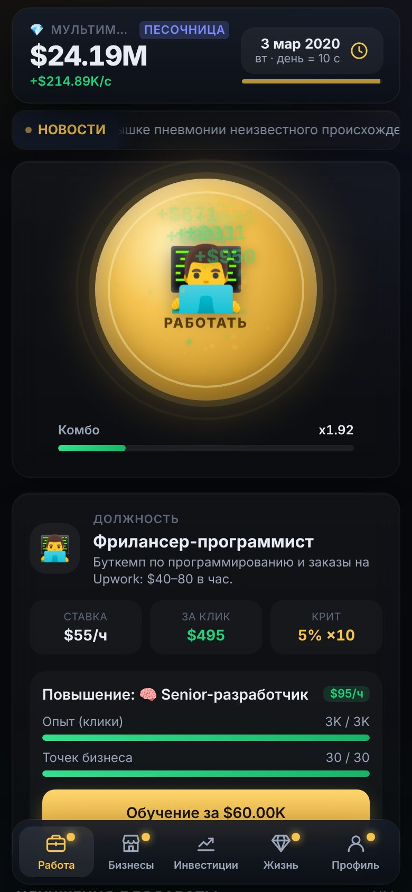
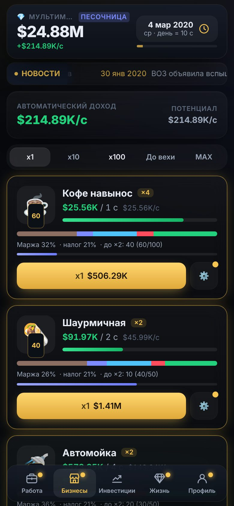
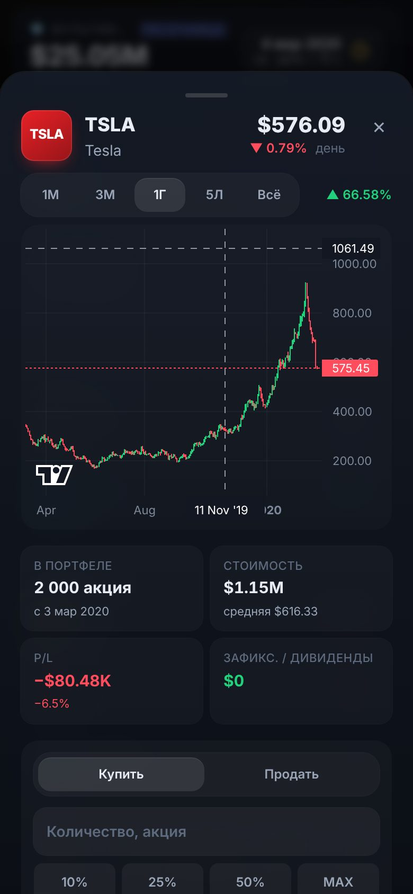
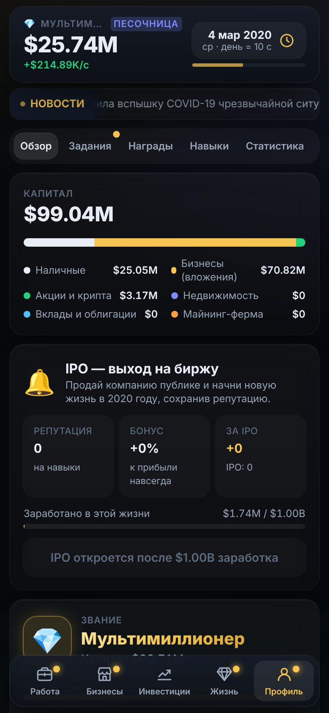

# 🏛️ Империя с нуля

Браузерный бизнес-кликер на **реальной истории рынков**. 1 января 2009 года, пустые карманы, смены курьером за $12 в час — и машина времени, которая повторяет настоящую историю: биткоин по $0,0008, IPO Tesla по $17, Nvidia до бума ИИ, COVID-обвал, нефть по −$37, крах LUNA и FTX.

<p>
  
  
  
  
</p>

## Быстрый старт

```bash
npm install
npm run dev          # http://localhost:5173
npm run build        # прод-сборка в dist/
npm run preview      # локальный просмотр сборки
```

Исторические цены уже собраны в `src/data/history/*.json` — игра работает офлайн и без API-лимитов.

## Что внутри

| Раздел | Что есть |
| --- | --- |
| **Работа** | 8 профессий от курьера ($12/ч) до CEO ($7 500/ч): клик = час работы. 14 улучшений, комбо x1→x5, крит 5% ×10, частицы, всплывающие цифры, звук (WebAudio) и вибрация |
| **Бизнесы** | 14 бизнесов: кофе навынос → шаурмичная → автомойка → кофейня → франшиза фастфуда → АЗС → супермаркеты → IT-студия → логистика → завод → банк → авиакомпания → нефтегаз → космос. Выручка, себестоимость, аренда, зарплаты, налог; вехи 25/50/100/200… дают ×2; менеджеры автоматизируют и работают офлайн; оптимизация расходов и маркетинг |
| **Акции** | AAPL, MSFT, NVDA, TSLA, AMZN, GOOGL, META, NFLX, KO, MCD, NKE, DIS, JPM, XOM, GME, ETF SPY и QQQ, золото, нефть WTI, EUR/USD. Номинальные цены того времени, реальные сплиты (NVDA 10:1, TSLA 3:1, AAPL 7:1…), дивиденды, график отчётов, выручка по годам, свечной график (lightweight-charts) с маркерами сплитов и новостей, биржа закрыта по выходным |
| **Крипта** | BTC, ETH, SOL, BNB, XRP, DOGE, LTC и «призраки» LUNA и FTT. Майнинг: 13 поколений железа от CPU 2009 года до Antminer S21 XP, реальный хешрейт сети и эмиссия (халвинги 2012/2016/2020/2024 уже в данных), электричество |
| **Недвижимость** | 10 городов (Нью-Йорк, Лондон, Дубай, Монако, Токио, Берлин, Прага, Париж, Майами, Сингапур), цена м² по историческим трендам, 5 типов объектов, аренда за вычетом налогов и обслуживания |
| **Банк** | Накопительный и срочный вклады, казначейские векселя и облигации 2Y/10Y (цена падает при росте ставок — урок SVB), кредит под залог с маржин-коллом. Все ставки — от реальной истории ставки ФРС |
| **События** | Бегущая строка и архив из 228 реальных событий 2000–2026. 24 исторические эпохи меняют спрос и расходы бизнесов (COVID закрывает кофейни и бустит доставку, нефтяные шоки бьют по авиакомпаниям, инфляция 2022 поднимает зарплаты). Случайные события с выбором: налоговая проверка, поломка, вирусный пост |
| **Живой режим** | Когда игровое время догоняет сегодняшний день, котировки приходят из CoinGecko и Finnhub, в ленте — реальные заголовки. Без ключей — детерминированная симуляция |
| **Жизнь** | 22 реальные вещи: Toyota Corolla → Bugatti Chiron, Casio → Patek Philippe Nautilus, съёмная комната → вилла на Лазурном берегу, лодка → суперъяхта и Gulfstream. Коллекция карточек и бонусы |
| **Звания** | Студент → … → Миллиардер → Топ-100 Forbes → Самый богатый человек планеты → … до 1e300, сравнение со снимками списка Forbes 2000–2025 |
| **Престиж** | IPO от $1 млрд заработка: репутация = ⌊15·√(заработано / $1 млрд)⌋, +2% к прибыли за очко навсегда; новая жизнь снова с 2009 года. Дерево из 14 навыков: MBA, инсайдерская интуиция (подсказки трендов до 90 дней вперёд), налоговая оптимизация, офлайн-часы, машина времени и др. |
| **Удержание** | Ежедневная награда с серией, 3 ежедневных и 3 еженедельных задания («Купи акцию до отчёта», «Переживи обвал без продаж»), 75 достижений («Купил BTC до $1», «Diamond hands», «Бэкдор Баффетта»), экран «Пока тебя не было», статистика: капитал, лучшие и худшие сделки, доходность портфеля против S&P 500 |
| **Режимы** | «История» (старт 1 января 2009) и «Песочница» (старт в 2000, 2003, 2008, 2010, 2013, 2016, 2020 или 2022) — отдельные сохранения |

Время: по умолчанию 1 реальная минута = 1 игровой день, в шапке можно ускорить до 1 дня в секунду или поставить календарь на паузу. Доход бизнесов идёт в реальном времени, скорость меняет только календарь (рынки, новости, проценты, аренду).

Сохранения: `localStorage`, автосейв каждые 10 секунд, экспорт/импорт строкой или файлом (Профиль → ⚙️ Настройки).

## Технологии

React 18 · TypeScript · Vite 5 · Tailwind CSS 3 · Framer Motion · Zustand + Immer · lightweight-charts · canvas-confetti.

```
src/
  config/        все цены, доходы, события и активы — JSON
  data/history/  дневные ряды цен 2000–2026 (собираются скриптом)
  data/macro.json  доходность 10Y, CPI, хешрейт и эмиссия BTC
  engine/        игровая логика без React: экономика, рынок, симуляция, сохранения
  store/         Zustand: игра и интерфейс
  components/    экраны и UI-кит
scripts/
  fetch-history.mjs   загрузка данных из публичных источников → data/raw
  build-history.mjs   сборка рядов → src/data/history
  anchors/stocks.mjs  опорные точки (квартальные закрытия) для акций
  balance-sim.ts      симулятор темпа игры
  engine-test.ts      дымовой тест движка
```

## Дизайн: «Деловая газета»

Руководство по стилю — отдельная страница: `npm run dev`, затем http://localhost:5173/styleguide/ (в сборке — `dist/styleguide/index.html`). Скриншоты — в [`docs/styleguide/`](docs/styleguide).

- Дизайн-система: `src/design/newsprint.css` (токены и классы `np-*`, утренний и вечерний выпуски) и компоненты в `src/design/`.
- Шрифты: Source Serif 4, IBM Plex Sans, IBM Plex Mono — из Google Fonts, упакованы через `@fontsource` (без внешних запросов).
- Иконки: Phosphor, вес Light — только навигация и служебные кнопки.
- Фотографии: `npm run images` скачивает изображения из манифеста `src/config/images.json` (Wikimedia Commons, при наличии ключей `PEXELS_API_KEY` / `UNSPLASH_ACCESS_KEY` — Pexels и Unsplash). Скрипт берёт только свободные лицензии (CC0, PD, CC BY, CC BY-SA, лицензии Pexels и Unsplash), конвертирует в WebP до 800px, вырезает однотонный фон у предметов и пишет авторов в `public/images/credits.json` и `src/data/images.json`. Хотлинкинга нет. Пока фото нет, показывается заглушка цвета бумаги с названием. Unsplash API по своим правилам просит показывать фото по их ссылкам, поэтому по умолчанию первым источником идёт Commons.
- Логотипы монет: набор `cryptocurrency-icons` (CC0). Логотипы компаний — SVG с Commons за флагом `useRealLogos` в манифесте; при `false` — тикер в рамке.

## Данные

```bash
npm run data          # = data:fetch + data:build
# за корпоративным прокси (Node ≥ 22.21):
NODE_USE_ENV_PROXY=1 npm run data
# SOL и LUNA с CoinGecko (нужен бесплатный Demo-ключ):
COINGECKO_API_KEY=... npm run data
```

`fetch-history.mjs` скачивает всё, что доступно, в `data/raw/`. `build-history.mjs` берёт реальные дневные ряды там, где они есть, а пробелы заполняет «мостом» между опорными точками: факторная модель (S&P 500 для акций, BTC для альткоинов, нефть WTI для XOM) с волатильностью из реального индекса VIX, которая точно проходит через исторические уровни. Всё детерминировано. После конца данных игра продолжает ряды симуляцией (GBM с дрейфом из `assets.json`), а в живом режиме — котировками API.

### Источники

| Данные | Источник | В текущей сборке |
| --- | --- | --- |
| BTC, ETH, BNB, XRP, DOGE, LTC, FTT — дневные цены | [CoinMetrics Community Data](https://github.com/coinmetrics/data) | реальные, до 23.05.2026 |
| Хешрейт и дневная эмиссия BTC | CoinMetrics Community Data | реальные |
| Нефть WTI — дневные цены (EIA) | [datasets/oil-prices](https://github.com/datasets/oil-prices) | реальные, вкл. −$37,63 20.04.2020 |
| EUR/USD — дневной курс (FRED) | [datasets/exchange-rates](https://github.com/datasets/exchange-rates) | реальные |
| Индекс VIX — дневной (CBOE) | [datasets/finance-vix](https://github.com/datasets/finance-vix) | реальные (волатильность модели) |
| S&P 500 — среднемесячный (Shiller) | [datasets/s-and-p-500](https://github.com/datasets/s-and-p-500) | реальные (2026) + закрытия месяцев и экстремумы |
| Золото — среднемесячное | [datasets/gold-prices](https://github.com/datasets/gold-prices) | реальные + дневной мост |
| Доходность 10-летних облигаций США (FRED) | [datasets/bond-yields-us-10y](https://github.com/datasets/bond-yields-us-10y) | реальные |
| Инфляция CPI-U (BLS) | [datasets/cpi-us](https://github.com/datasets/cpi-us) | реальные |
| Ставка ФРС | решения FOMC ([federalreserve.gov](https://www.federalreserve.gov/monetarypolicy/openmarket.htm)) | реальные, `src/config/rates.json` |
| Акции и ETF — дневные цены, сплиты, дивиденды | Yahoo Finance chart API → Stooq (запасной) | **приближение**: в среде сборки эти API были недоступны, поэтому ряды построены по квартальным закрытиям и экстремумам (`scripts/anchors/stocks.mjs`) + факторной модели. Запустите `npm run data` с доступом в интернет — и они заменятся реальными дневными данными |
| SOL, LUNA | CoinGecko `/market_chart` (Demo-ключ) | **приближение** по месячным уровням + модель от BTC |
| Сплиты, дивиденды, даты отчётов, выручка компаний | годовые отчёты и пресс-релизы компаний | приблизительные значения в `corporate.json` и `assets.json` |
| Цены жилья за м² | открытые индексы и обзоры рынков городов | приблизительные тренды в `realEstate.json` |
| Список Forbes | снимки Forbes Billionaires 2000–2025 | приблизительные состояния в `ranks.json` |
| Майнинг-оборудование | спецификации производителей (Bitmain, Canaan, Butterfly Labs) | `mining.json` |
| События и новости | общедоступная хроника событий | только реальные факты, `news.json` и `events.json` |

У каждого актива в карточке указано, откуда взяты данные и где начинается симуляция.

## Живой режим и API

Скопируйте `.env.example` в `.env` и заполните ключи (оба необязательны):

| Сервис | Для чего | Бесплатный тариф (данные на осень 2026, проверьте перед использованием) |
| --- | --- | --- |
| [CoinGecko Demo](https://www.coingecko.com/en/api/pricing) | цены криптовалют | ~30–100 запросов/мин, 10 000 кредитов/мес — игра опрашивает раз в 5 минут одним запросом |
| [Finnhub](https://finnhub.io/register) | котировки акций/ETF, новости | 60 запросов/мин, только некоммерческое использование — 17 тикеров раз в 2 минуты |
| Alpha Vantage | не используется | 25 запросов в день — слишком мало для живого режима |

Интервалы опроса: `VITE_LIVE_CRYPTO_POLL_SEC`, `VITE_LIVE_STOCKS_POLL_SEC`. Опрос идёт только в живом режиме и только пока вкладка открыта; при ошибке или без ключа цены продолжаются симуляцией. Живой режим можно выключить в настройках.

## Баланс

Все числа — в `src/config/*.json`, формулы — в `src/engine/economy.ts`, `finance.ts`, `modifiers.ts` с комментариями:

- цена n-й точки = `base · growth^n · (1 − скидка)`, покупка k точек — сумма геометрической прогрессии;
- прибыль цикла = `выручка · точки · 2^вехи · маркетинг · множители · спрос эпохи · (1 − доли расходов)`, минус налог (35% до 2018, 21% после реформы — или своя ставка);
- клик = `ставка профессии · улучшения · навыки + доля дохода/сек`, × комбо, × крит;
- майнинг: `BTC/день = H_игрока / (H_сети + H_игрока) · эмиссия дня`;
- облигации: `цена ≈ номинал · (1 − D · (y_рынка − купон))`.

Реальные значения взяты за основу, темп подкручен ради игры. Проверка темпа — `npm run sim` (жадный бот): первая покупка ~10 с, первый бизнес ~1–1,5 мин, порог IPO ~1 ч активной игры, вторая жизнь — в 2 раза быстрее.

```bash
npm run sim -- --minutes 180          # первая жизнь
npm run sim -- --rep 40 --mba 2       # с бонусами престижа
npm run test:engine                   # сплиты, дивиденды, майнинг, офлайн, IPO
```

Числа хранятся в `double` (до ~1.8e308), потолок — 1e306; форматирование: $1.23K, M, B, T, затем научная запись.
